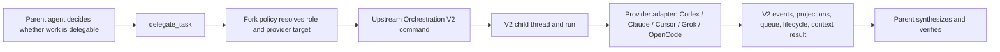

# Orchestration V2 delegation rewrite plan

Status: implementation-ready design, blocked on the upstream Orchestration V2 landing  
Prepared: 2026-07-30  
Repository: `aaSchcolnik/t3code-w-voice`  
Maintained branch: `subagents-and-mcps`  
Upstream: `pingdotgg/t3code`  
Primary upstream change: [PR #2829 — feat(orchestrator): introduce new orchestrator](https://github.com/pingdotgg/t3code/pull/2829)

## 1. Executive decision

When upstream Orchestration V2 lands, this fork should adopt it as the **only execution and
persistence authority** for:

- application threads and runs;
- provider sessions and provider-native continuation identities;
- provider switching and context handoffs;
- queued, steerable, and interruptible runs;
- app-owned delegated child threads;
- provider-native subagent projections;
- cancellation, waiting, restart recovery, and finalization;
- web, desktop, and mobile orchestration state.

The fork should **not** retain a second delegated-run runtime beside V2. Our current JSON/NDJSON
repositories, run services, native trackers, RPC streams, and Subagents sidebar were appropriate
while upstream had no cohesive orchestration domain. Once V2 is merged, keeping both models would
create two sources of truth for the same work and make provider switching less reliable, not more.

The fork should retain and adapt the part upstream does not currently provide:

1. Off / Suggested / Proactive delegation policy.
2. Proactive guidance that tells the parent agent when delegation is useful.
3. Scout / Worker task classification.
4. Ordered provider-instance/model policy with project and skill overrides.
5. Deterministic server-side target selection and route diagnostics.
6. Workflow-specific delegation guidance and parent-owned synthesis/verification.
7. A strict no-reroute-after-provider-acceptance rule.

The resulting architecture is intentionally asymmetric:



The policy may select a provider. It must never own the child run.

## 2. Verified baseline and assumptions

This plan is based on upstream PR #2829 at commit
`5887de152182702da48e7a2445db790fc526fa9d`, inspected on 2026-07-30. At that point:

- PR #2829 is open, non-draft, and not merged.
- The branch contains Orchestration V2 adapters for Codex, Claude Agent SDK, Cursor Agent SDK,
  Grok, OpenCode, and ACP Registry.
- V2 uses app-owned threads, runs, attempts, execution nodes, provider-thread/session bindings,
  context transfers, projections, an event store, and an effect outbox.
- `delegate_task` creates a V2 child thread and run. The child gets the supplied task prompt plus
  an optional role instruction; parent conversation history is not copied.
- A delegate target may specify provider instance, driver, and model. Omitted provider/model values
  inherit from the parent; another provider without a model uses its first advertised model.
- The upstream orchestration instruction tells an agent to delegate when the **user explicitly asks**
  for an agent, worker, delegation, or parallel help. It does not tell the agent to proactively find
  useful independent work.
- `orchestrator_capabilities` exposes provider/model availability and whether cross-provider child
  work is possible. It reports capability, not which provider is best for a task.
- Upstream provider switching keeps one application thread while maintaining provider-native
  session identities and explicit full/delta context handoffs.
- Queued messages are durable V2 runs, not a UI-only prompt list.
- The already-merged provider-agnostic prompt stash is separate unsent composer scratch state. It
  must remain separate from V2’s durable queued runs.
- The V2 Cursor adapter uses the official `@cursor/sdk` with `Agent.create`, `Agent.resume`,
  `send`, `run.wait`, `run.cancel`, `Agent.messages.list`, and `agent.close`.
- Cursor V2 supports MCP tools, interrupt, interrupt-and-restart steering, and subagent reporting.
  It currently declares no native thread fork, no native rollback, no active steering, no exposed
  subagent thread IDs, weak native item identity, and no command approval.

Relevant upstream sources:

- [Orchestrator MCP design](https://github.com/pingdotgg/t3code/blob/5887de152182702da48e7a2445db790fc526fa9d/docs/orchestration-v2/orchestrator-mcp-server.md)
- [Provider switching and context](https://github.com/pingdotgg/t3code/blob/5887de152182702da48e7a2445db790fc526fa9d/docs/orchestration-v2/provider-switching-and-context.md)
- [T3 orchestration instructions](https://github.com/pingdotgg/t3code/blob/5887de152182702da48e7a2445db790fc526fa9d/apps/server/src/provider/T3OrchestrationInstructions.ts)
- [Cursor V2 adapter](https://github.com/pingdotgg/t3code/blob/5887de152182702da48e7a2445db790fc526fa9d/apps/server/src/orchestration-v2/Adapters/CursorAdapterV2.ts)
- [Cursor Agent SDK boundary](https://github.com/pingdotgg/t3code/blob/5887de152182702da48e7a2445db790fc526fa9d/apps/server/src/orchestration-v2/Adapters/CursorAgentSdk.ts)

This is a landing-triggered plan, not a patch against the current branch. Every path and schema must
be revalidated against the **actual merged SHA** before implementation. PR #2829 is large and is
still changing.

## 3. Related upstream work that affects the UI decision

Subagent observability is being developed in stacked, unmerged PRs:

- [#4779 — subagent observability data model (1/5)](https://github.com/pingdotgg/t3code/pull/4779)
- [#4629 — adapter observability population (2/5)](https://github.com/pingdotgg/t3code/pull/4629)
- [#4662 — reused subagent attribution (3/5)](https://github.com/pingdotgg/t3code/pull/4662)
- [#4663 — Agents panel (4/5)](https://github.com/pingdotgg/t3code/pull/4663)
- [#4664 — hide child threads from user-facing lists (5/5)](https://github.com/pingdotgg/t3code/pull/4664)

PR #4664 explicitly trades away access to the full child transcript. Its proposed UI hides child
threads from user-facing lists and removes “Open subagent thread” on web and mobile. This is not
merged product behavior yet.

Our decision:

- Do not keep the existing dedicated Subagents sidebar as a competing navigation model.
- Prefer upstream inline subagent items plus an upstream Agents/details panel.
- Do not accept permanent loss of inspectability. If the final upstream implementation makes the
  full transcript unreachable, add a **parent-scoped, read-only “Inspect transcript” drawer** to the
  upstream Agents/details surface. It should read the canonical V2 child timeline; it must not
  restore child threads to the global sidebar or revive our NDJSON transcript model.
- If upstream preserves direct child-thread navigation, use it and add no fork-specific transcript
  UI.

This gives users evidence without turning every delegated task into a first-class sidebar
conversation.

## 4. Goals

### 4.1 Functional goals

- Cross-provider delegation uses `delegate_task` and V2 child threads.
- Parent agents can proactively identify independent, bounded work when policy allows it.
- The server can deterministically choose a different provider/model for a child based on role,
  project policy, skill policy, availability, and declared capabilities.
- Explicit user or tool target constraints always win over automatic policy.
- Provider switching inside an application thread uses V2 handoffs, not fork-specific session
  restart logic.
- Cursor child work runs through the upstream official Cursor Agent SDK adapter.
- Route choice remains explainable after restart and on remote clients.
- Web, desktop, and mobile render the same server-authoritative lifecycle.
- Existing delegated-run history is preserved or migrated before legacy readers are removed.

### 4.2 Architectural goals

- One durable orchestration aggregate.
- One run status model.
- One provider capability model.
- One queue and steering model.
- One cancellation path.
- One subagent identity and lineage model.
- Provider-specific complexity stays at provider adapter boundaries.
- Policy is pure and deterministic; it does not call a second LLM.
- UI reads projections and does not reconstruct orchestration state.

### 4.3 Operational goals

- The daily upstream sync detects the first V2 landing and reports a migration handoff.
- The nightly sync does not attempt the rewrite.
- Migration is reversible until legacy history has been validated.
- The cutover can be feature-gated and rolled out per environment/project.

## 5. Non-goals

- Reimplementing upstream V2 in the fork before it merges.
- Maintaining `delegate_start` and `delegate_task` as equal long-term APIs.
- Retaining an independent custom delegated-run database after V2 cutover.
- Selecting providers with another LLM.
- Copying a parent’s entire transcript into every child.
- Exposing every delegated child as a normal sidebar task.
- Automatically retrying work on another provider after that provider may have edited files.
- Treating Cursor native subagents as the cross-provider orchestration primitive.
- Expanding the rewrite into voice, unrelated MCP tools, knowledge storage, or desktop packaging.

## 6. Target responsibility model

| Concern                     | Authority after rewrite                 | Fork behavior                                                   |
| --------------------------- | --------------------------------------- | --------------------------------------------------------------- |
| Thread/run identity         | Upstream V2                             | Consume canonical IDs                                           |
| Provider session identity   | Upstream V2                             | No duplicate session directory                                  |
| Cross-provider continuation | Upstream V2                             | Use handoff APIs and events                                     |
| Queue/steer/restart         | Upstream V2                             | No custom prompt/run queue                                      |
| Child creation              | Upstream `delegate_task`                | Add policy resolution before command                            |
| Run persistence             | Upstream event store/projections        | Persist only route-policy facts as V2 data                      |
| Provider availability       | Upstream provider registry/capabilities | Filter policy candidates against it                             |
| “When to delegate”          | Fork policy/instructions                | Keep Off/Suggested/Proactive                                    |
| “Which provider”            | Fork deterministic resolver             | Return an upstream target                                       |
| Child result delivery       | Upstream context transfer/finalization  | No custom wake ledger                                           |
| Subagent UI                 | Upstream timeline/details/Agents panel  | Add route explanation and transcript inspection only if missing |
| History cutover             | One-shot migration                      | Import old records, then remove legacy readers                  |

## 7. Keep, adapt, remove

### 7.1 Keep with minimal semantic change

#### Delegation modes

Keep:

- `Off`: no new app-owned delegation may be created; existing V2 children remain visible and
  controllable.
- `Suggested`: `delegate_task` is available, but no proactive instruction is injected.
- `Proactive`: `delegate_task` is available and the parent receives explicit delegation guidance.

Preserve the server as the enforcement boundary. Hiding a tool in the prompt is not sufficient for
Off mode.

#### Parent-agent delegation philosophy

Keep these rules:

- Delegate only independent, bounded work.
- Use Scout-like work for research, evidence gathering, planning exploration, and review.
- Use Worker-like work for implementation, debugging, and testing.
- Keep synthesis, consequential decisions, integration, and final verification on the parent.
- Parallel implementation requires disjoint files or explicitly serialized dependencies.
- Do not delegate trivial work whose coordination cost is higher than execution.
- Do not recursively delegate from a delegated child unless upstream later adds a deliberate,
  bounded recursion policy.

#### Ordered target policy

Keep:

- global defaults;
- project overrides;
- workflow overrides;
- skill-version overrides;
- explicit provider instance/model constraints;
- stable ordering;
- capability filtering;
- route reason codes and policy version.

The policy output changes from “start this custom delegated run” to “use this target in the
upstream V2 delegated-task command.”

#### Knowledge and skills

Keep project knowledge, project instruction capsules, skill discovery, Implementation Engine
workflow guidance, consensus/scanner concepts, and related authorization. Change only their
delegation tool vocabulary and target rendering.

#### Transport compatibility unrelated to lifecycle

Keep the MCP 2026 transport work that remains independently useful: endpoint negotiation,
authentication, advertised capabilities, and protocol compatibility. Remove any portions whose
only purpose is projecting the legacy delegated-run lifecycle.

### 7.2 Adapt

#### `delegate_start` to `delegate_task`

Long-term, `delegate_task` is the only neutral child-work API.

Migration behavior:

1. Add policy-aware target resolution to the upstream `delegate_task` path.
2. Keep `delegate_start` as a temporary compatibility adapter.
3. The adapter translates one legacy lane into one V2 `delegate_task`.
4. A legacy multi-lane request expands into multiple V2 commands with stable child request IDs.
5. The adapter returns V2 task/thread/run IDs and marks legacy fields deprecated.
6. Remove the adapter only after all built-in provider instructions, skills, clients, and stored
   templates use `delegate_task`.

Do not add an upstream-looking `delegate_tasks` batch API unless a real atomicity requirement
remains after migration.

#### Batch behavior

The current one-to-four-lane atomic reservation should not be carried forward automatically.
Upstream V2 models each child as a durable task. The parent can invoke `delegate_task` once per
independent lane.

Keep:

- stable per-lane `clientRequestId`;
- per-parent and environment admission limits;
- workflow grouping metadata when several children belong to one parent phase;
- deterministic diversity preference where several children are launched together.

Remove:

- a separate `DelegationBatch` lifecycle;
- batch status as a second terminality model;
- a requirement that all lanes allocate atomically.

If partial launch is unacceptable for a specific workflow, the parent must validate capabilities
for all intended targets before issuing mutations, then reconcile any partial result explicitly.

#### Role mapping

Map upstream roles to policy roles:

| Upstream `delegate_task.role` | Policy class | Default behavior                                                 |
| ----------------------------- | ------------ | ---------------------------------------------------------------- |
| `research`                    | Scout        | Resolve Scout chain                                              |
| `review`                      | Scout        | Resolve Scout chain, prefer independent provider when configured |
| `design`                      | Scout        | Resolve Scout chain; parent owns final design                    |
| `implementation`              | Worker       | Resolve Worker chain                                             |
| `test`                        | Worker       | Resolve Worker chain                                             |
| `general` or omitted          | Inherit      | Parent provider unless workflow supplies a role                  |

Do not infer provider choice from the free-form task string in the server. The parent classifies the
task through the typed role; the server validates and resolves it.

#### Proactive instructions

Replace upstream’s explicit-request-only behavior in Proactive mode with:

> Actively look for independent, bounded work that reduces latency or protects the parent context.
> Use `delegate_task` once per child task. Classify research, evidence, review, and design
> exploration with the corresponding Scout-like role; classify implementation, debugging, and
> testing with the corresponding Worker-like role. Omit the provider target unless the user
> explicitly requested one or you have concrete capability evidence; T3 Code will resolve policy.
> Keep synthesis, consequential decisions, integration, and final verification on the parent.
> Do not delegate trivial sequential work or concurrent edits to overlapping files.

Suggested mode retains upstream’s explicit-request semantics. Off mode omits the instruction and
denies mutations server-side.

#### Policy resolver

Introduce a small pure service, named according to the final V2 conventions, with an input similar
to:

```ts
type ResolveDelegationTargetInput = {
  parentThread: OrchestrationV2ThreadProjection;
  role: OrchestratorMcpDelegateTaskInput["role"];
  explicitTarget?: OrchestratorMcpTarget;
  providerCapabilities: ReadonlyArray<ProviderCapabilitySnapshot>;
  projectPolicy: EffectiveDelegationPolicy;
  workflow?: EngineWorkflowName;
  skillPolicy?: EngineDelegationSkillOverride;
  siblingSelections?: ReadonlyArray<ModelSelection>;
};
```

It returns:

```ts
type ResolvedDelegationTarget = {
  selected: ModelSelection;
  eligibleFallbacks: ReadonlyArray<ModelSelection>;
  policySource:
    | "explicit_target"
    | "skill_override"
    | "workflow_override"
    | "role_chain"
    | "provider_default"
    | "parent_inherit";
  evaluations: ReadonlyArray<CandidateEvaluation>;
  policyVersion: string;
};
```

Precedence:

1. Explicit target from the user/tool call.
2. Skill-version override.
3. Workflow override.
4. Project-effective role chain.
5. Global role chain.
6. Parent provider/model inheritance.

Candidates must be removed when the upstream provider registry says the instance is disabled,
uninstalled, unavailable, unauthenticated, missing a V2 adapter, missing the requested model, or
incapable of the required runtime/workspace behavior.

#### Route diagnostics

Persist route facts in the V2 event/application domain, attached to the app-owned subagent or its
spawn context transfer:

- selected provider instance/model/options;
- policy source and version;
- evaluated candidates and reason codes;
- fallback chain;
- attempt transitions;
- whether the user explicitly constrained the target.

Do not persist task text again in a policy table. The V2 child prompt is already authoritative.

Expose a compact route summary in the normal V2 subagent item and detailed diagnostics in the item
inspector or Agents panel.

#### Safe fallback

Fallback must be implemented, if retained, inside V2’s launch/attempt boundary. It must not call the
legacy `DelegatedRunService`.

A fallback is allowed only when all are true:

- the policy persisted an eligible next candidate;
- the provider session/turn has not returned an accepted native run/thread identity;
- no provider event for the attempt has been ingested;
- no file-changing effect could have been accepted;
- V2 records the failed attempt before selecting the next candidate.

After acceptance, failure is terminal for that child. The parent may inspect the failure and decide
whether to create a new child explicitly; the server must not replay work silently.

If the merged V2 code does not expose a trustworthy acceptance boundary, ship target selection
without automatic runtime fallback first. Reliability is more important than preserving an unsafe
feature.

### 7.3 Remove after parity and migration

Remove the fork-owned lifecycle and persistence implementations:

- `apps/server/src/orchestration/DelegatedRunRepository.ts`
- `apps/server/src/orchestration/DelegatedRunService.ts`
- `apps/server/src/orchestration/DelegationCoordinator.ts`
- `apps/server/src/orchestration/SubagentRunService.ts`
- `apps/server/src/orchestration/SubagentRunDetails.ts`
- `apps/server/src/orchestration/SubagentRunRespond.ts`
- `apps/server/src/orchestration/SubagentTranscriptService.ts`
- their dedicated JSON/NDJSON stores, delivery ledger, wake bookkeeping, and tests.

Remove provider-specific custom lifecycle code after V2 parity:

- `apps/server/src/provider/DelegatedProviderResolver.ts` after its useful validation is moved into
  the V2 policy resolver;
- `apps/server/src/provider/DelegationRouterService.ts` after route resolution is a V2 service;
- provider-specific delegated-run launch aliases and handlers;
- custom Codex, Claude, and Cursor native subagent trackers when the merged V2 adapters project the
  same native identities and statuses;
- rollout flags whose only purpose is switching between custom and activity-derived native
  subagent lists.

Remove duplicate contracts after compatibility readers expire:

- `packages/contracts/src/delegatedRun.ts`;
- legacy-only portions of `packages/contracts/src/delegationRouter.ts`;
- legacy-only portions of `packages/contracts/src/subagent.ts`;
- custom subscribe/status/transcript/cancel/respond RPC schemas replaced by V2 thread/run
  operations.

Remove duplicate client state:

- `packages/client-runtime/src/state/subagents.ts` legacy projections;
- `apps/web/src/state/subagents.ts`;
- `apps/mobile/src/state/subagents.ts`;
- independent run selection state once V2 item/thread selection is authoritative.

Remove the dedicated custom UI after upstream parity:

- `apps/web/src/components/SubagentsPanel.tsx`;
- the custom transcript timeline/panel components when V2 timeline rendering covers them;
- dedicated mobile subagent run list/details routes;
- custom settings UI that is replaced by a smaller Delegation Policy section.

Do not delete anything in this list until its replacement passes the parity gates in Section 15.

## 8. Cursor Agent SDK implementation

### 8.1 Adopt upstream’s boundary

Use upstream `CursorAgentSdkRunner` and `CursorAdapterV2` as the sole Cursor execution path for V2.
Do not port the current ACP `Task`-tool parser into the app-owned delegation path.

The adapter should continue to own:

- `Agent.create` versus `Agent.resume`;
- model and option mapping;
- runtime-mode to sandbox/auto-review mapping;
- SDK message and delta normalization;
- authenticated T3 MCP injection;
- idempotency keys;
- cancellation and close behavior;
- message replay;
- redacted protocol logging;
- Cursor-native subagent event normalization.

The policy layer should only provide the selected `providerInstanceId`, model, and supported
options.

Cursor does not expose a normal system/developer-instruction channel in this adapter. Upstream
injects T3 orchestration guidance into the first synthetic user prompt. The fork’s Proactive policy
must be composed into that same first-run wrapper **exactly once** and must not be re-injected when
`Agent.resume` continues the provider thread.

### 8.2 Capability-aware behavior

Respect the merged adapter’s advertised capabilities:

- Use portable V2 fork/context transfer when Cursor has no native fork.
- Use V2 rollback/checkpoint behavior rather than claiming Cursor-native rollback.
- Use interrupt-and-restart when active steering is unavailable.
- Use app-owned child threads for cross-provider delegation.
- Treat Cursor-native subagents as provider-native projections, not addressable T3 child threads,
  unless a later SDK version exposes stable child IDs.
- Do not show approval controls the SDK cannot honor.
- Do not advertise structured questions or approval callbacks if the merged Cursor SDK adapter
  still reports them unsupported. Either capability-filter Cursor for a child that requires
  interaction or return a visible typed failure for an explicit Cursor target.
- Preserve weak identity caveats in replay/deduplication tests.

### 8.3 Cursor provider selection

For a Cursor candidate, validate through the upstream provider snapshot:

- configured instance exists;
- V2 adapter is registered;
- instance is enabled, installed, available, and authenticated;
- requested model is advertised;
- requested thinking/context/fast options are supported;
- runtime mode can be represented safely by Cursor sandbox/auto-review controls.

If Cursor is the selected Scout or Worker target and becomes unavailable before dispatch, apply the
safe fallback rule. If it fails after acceptance, surface the V2 failure to the parent.

### 8.4 Cursor verification

Focused tests must cover:

- Codex parent delegates to Cursor child;
- Claude parent delegates to Cursor child;
- Cursor parent delegates to Codex child;
- Cursor child receives only the supplied task packet;
- T3 MCP credentials are present and redacted from logs;
- `Agent.create` and `Agent.resume`;
- cancellation including nested `AbortError`;
- server restart and message replay;
- interrupt-and-restart steering;
- model options and unavailable model rejection;
- Cursor-native nested subagent visibility;
- no false promise of native fork/rollback/approval.

## 9. Provider switching

Delete or bypass the V1 rule that binds an established application thread permanently to one
driver. V2’s application thread remains stable while provider-native sessions change underneath it.

Use upstream behavior:

- resume an existing provider-native thread when returning to a provider;
- inject a delta handoff containing off-provider work since that provider was last active;
- use a full handoff when no usable prior provider context exists;
- persist the handoff as a context transfer and timeline item;
- keep provider selection in the canonical application-thread projection.

Do not mix this with child routing:

- Switching the parent provider changes who continues the application thread.
- Delegating to another provider creates a child thread owned by the parent.
- An ordinary top-level thread is created only when the user explicitly asks for a separate task.

Add explicit integration coverage for Codex → Cursor → Codex, because the inspected upstream suite
proves the generic model and Cursor adapter independently but must be rechecked against the merged
suite for this exact sequence.

## 10. UI and navigation

### 10.1 Web and desktop

Preferred final shape:

- normal sidebar lists user-owned top-level threads only;
- child status appears inline in the parent timeline;
- an Agents/details panel aggregates child/provider-native activity;
- queue control uses upstream durable V2 runs;
- provider switching uses the upstream provider/model picker;
- route diagnostics open from the subagent item or Agents panel;
- full transcript inspection, when supported, is parent-scoped and read-only.

Desktop wraps web, so no separate orchestration store should be added in Electron. Verify desktop
menus, notifications, deep links, and remote host mode against the web state.

### 10.2 Mobile

Use shared V2 projections and mobile’s V2 thread feed, queue control, relationship banner, runtime
request handling, and run-scoped interruption.

Remove the separate custom subagent list/details navigation only after mobile can:

- see active and terminal child status;
- inspect result and route summary;
- cancel a cancellable child;
- answer supported child input through canonical V2 runtime requests;
- inspect a full transcript if web can, or receive an explicit documented limitation;
- navigate back to the parent reliably.

Do not ship a web-only policy state. Global/project settings stay server-authoritative and mobile
must at least render the effective policy and route.

### 10.3 Settings

Keep a focused Delegation Policy settings section:

- mode: Off / Suggested / Proactive;
- Scout chain;
- Worker chain;
- optional workflow/skill overrides;
- maximum active children per parent/environment;
- safe pre-dispatch fallback toggle;
- optional provider-diversity preference;
- effective-policy source and validation errors.

Remove settings that control the old repository, transcript stream, polling, wake ledger, or legacy
provider aliases.

## 11. Persistence and history migration

Upstream’s V1 thread importer does not automatically guarantee migration of this fork’s custom
delegated-run JSON/NDJSON stores. Treat that as a separate migration.

There is also a mandatory SQL migration audit before any real database is opened. The current local
fork already uses migrations 036–039 for fork/V1 work, while the inspected V2 branch uses 036–044
for its foundation and related features. Resolve by migration identity and content, then renumber
fork-only migrations above the final upstream maximum. Test upgrades from both a representative
fork database and a clean upstream database. A numeric collision must never be “resolved” by
assuming equal numbers mean equal schema.

### 11.1 Precondition

Before cutover:

1. Set effective delegation mode to Off for migration.
2. Drain or explicitly cancel every non-terminal legacy delegated run.
3. Stop legacy repository writers.
4. Back up legacy delegated-run JSON and transcript NDJSON under an explicit state-directory path.
5. Validate the backup with the existing reader and fixtures.

Never infer or touch the live `~/.t3/userdata` directory during development verification.

### 11.2 One-shot importer

Implement an idempotent `LegacyDelegatedRunImporter` beside the upstream V1 import boundary.
For each terminal legacy run:

- create or correlate a V2 child thread with subagent lineage;
- create a historical V2 run with the terminal status;
- preserve provider instance, requested/resolved model/options, timestamps, title, and task preview;
- create normalized timeline items for assistant result, errors, questions, and supported tool rows;
- persist route policy facts;
- create the terminal result context transfer to the parent;
- record the legacy run ID as an import key;
- never dispatch a provider effect.

Do not blindly replay raw provider payloads into V2. Normalize through a migration-specific adapter
and retain the raw backup for forensic/downgrade use.

### 11.3 Compatibility window

For one release:

- read V2 as authoritative;
- retain a read-only legacy history fallback for records the importer rejected;
- expose import counts and errors;
- block deletion of backups.

After verified parity:

- remove legacy writers first;
- remove legacy RPC and UI readers;
- remove compatibility contracts;
- retain an export tool or documented archive path for raw history.

## 12. Implementation phases

### Phase 0 — Landing detection and freeze

Trigger: daily sync proves Orchestration V2 was newly added to `upstream/main` and is present in the
verified `origin/subagents-and-mcps` result.

Actions:

- record upstream landing SHA and fork integration SHA;
- report the plan path;
- do not start the rewrite in the nightly task;
- create a dedicated implementation task/worktree;
- set a temporary “legacy writes still authoritative” marker;
- inspect the final merged files, migrations, contracts, and stacked observability status.

Exit: a human-started implementation task has an exact merged baseline and conflict inventory.

### Phase 1 — Make upstream V2 healthy in the fork

Actions:

- resolve merge conflicts in provider adapters, MCP registration, contracts, migrations, web state,
  mobile state, and settings;
- preserve unrelated voice, knowledge, skills, usage, notification, desktop, and mobile features;
- run upstream V2 migration/replay tests before adding policy behavior;
- confirm the fork boots with a copied disposable development database;
- verify V1 import and V2 shell/detail snapshots.

Do not preserve a custom orchestration behavior merely by taking “ours” during conflicts.

Exit: upstream V2 behavior passes unchanged in the fork.

### Phase 2 — Introduce the policy seam

Actions:

- add effective Off/Suggested/Proactive policy to the V2 provider-session instruction builder;
- implement pure role-to-target resolution;
- map global/project/workflow/skill policy to upstream provider snapshots;
- enforce Off at the `delegate_task` application boundary;
- persist route decision events/metadata in V2;
- expose policy diagnostics through canonical projections;
- port focused unit tests from the current router.

Exit: `delegate_task` with no explicit target deterministically selects the correct V2 target and
explicit targets remain unchanged.

### Phase 3 — Port workflow guidance

Actions:

- replace `delegate_start`, `cursor_start`, `codex_start`, and `claude_start` wording in generated
  skill instructions with `delegate_task`;
- map Scout/Worker workflow guidance to typed upstream roles;
- retain parent-owned Judge responsibilities;
- keep consensus/scanner fan-out as multiple V2 delegated tasks;
- update knowledge capability and instruction-capsule tests.

Exit: plan, implement, audit, and consensus workflows produce valid V2 delegation instructions.

### Phase 4 — Provider and Cursor parity

Actions:

- adopt final upstream V2 adapters without custom parallel session managers;
- move reusable validation from `DelegatedProviderResolver` into policy candidate validation;
- validate Codex, Claude, Cursor, Grok, OpenCode, and ACP Registry decisions;
- remove Cursor ACP task tracking only after SDK-native projection parity;
- add explicit cross-provider and Cursor SDK integration cases;
- implement safe pre-dispatch fallback only if the merged V2 acceptance boundary is provable.

Exit: all configured providers either pass child-run conformance or are capability-filtered with an
actionable reason.

### Phase 5 — UI convergence

Actions:

- switch route/status/result rendering to V2 projections;
- use upstream queue and relationship controls;
- remove the custom Subagents sidebar entry and panel;
- add route details to the upstream item inspector/Agents panel;
- decide transcript behavior based on the merged observability stack;
- add a parent-scoped transcript drawer only if upstream otherwise removes access;
- update mobile in the same phase.

Exit: no UI reads the legacy subagent run store, and every required control uses V2 IDs.

### Phase 6 — History migration

Actions:

- add the one-shot importer and migration state;
- test forward import, restart idempotency, partial failure, and downgrade archive;
- migrate a representative disposable state copy;
- reconcile counts, terminal states, results, and route metadata;
- keep legacy backup/read-only fallback for the compatibility window.

Exit: all supported legacy history is visible through V2 or explicitly listed as an archived import
failure.

### Phase 7 — Remove legacy runtime

Actions:

- delete legacy writers, coordinators, trackers, streams, services, and their wiring;
- delete compatibility tools after prompt/client migration;
- remove duplicate contracts and client atoms;
- remove custom run/transcript UI;
- update docs and encyclopedia vocabulary;
- prove no imports, capability mappings, routes, or tests reference deleted APIs.

Exit: there is exactly one orchestration lifecycle in the process.

### Phase 8 — Rollout

Actions:

- ship with default mode unchanged unless product policy explicitly changes it;
- enable Suggested first;
- run shadow route evaluation against real explicit delegation traffic;
- enable Proactive per project/environment;
- measure delegation usefulness, failure, latency, fallback, duplicate work, and terminal
  completeness without recording task content;
- remove compatibility readers only after the observation window passes.

Exit: Proactive meets defined reliability gates and rollback remains documented.

## 13. Suggested implementation commits

Keep commits reviewable and avoid combining migration, UI, and deletion:

1. `chore(sync): integrate upstream orchestration v2`
2. `feat(server): resolve delegation policy through v2 targets`
3. `feat(server): inject proactive v2 delegation guidance`
4. `feat(server): persist v2 delegation route diagnostics`
5. `feat(server): add safe pre-dispatch provider fallback`
6. `feat(knowledge): target workflows through delegate_task`
7. `feat(web): render delegation policy in v2 agent details`
8. `feat(mobile): use v2 delegated task controls`
9. `feat(server): import legacy delegated run history`
10. `refactor(server): remove legacy delegated run runtime`
11. `refactor(clients): remove legacy subagent stores and sidebar`
12. `docs: document orchestration v2 delegation policy`

Skip commit 5 if the merged acceptance boundary cannot support it safely.

## 14. Verification matrix

### 14.1 Policy

- Off denies new `delegate_task`, including compatibility aliases.
- Off leaves existing child read/cancel/input operations available.
- Suggested permits explicit delegation but injects no proactive text.
- Proactive injects guidance on every supported provider without duplicating it on continuation.
- Explicit target beats every policy override.
- Skill override beats workflow, project role chain, and global defaults.
- Unavailable/disabled/uninstalled/unauthenticated/no-adapter providers are excluded.
- Unknown models/options fail before child dispatch.
- General role inherits parent when no policy says otherwise.
- Delegated children cannot recursively delegate when depth policy forbids it.

### 14.2 Lifecycle

- create, queue, start, wait, complete, fail, cancel, interrupt;
- restart during queued, running, waiting-for-input, and finalization states;
- idempotent `clientRequestId`;
- result context transfer exactly once;
- no duplicate child after reconnect;
- parent wake/result visibility without legacy polling;
- no fallback after provider acceptance;
- route decision survives projection rebuild.

### 14.3 Provider matrix

At minimum:

| Parent            | Child                  | Required             |
| ----------------- | ---------------------- | -------------------- |
| Codex             | Codex                  | Yes                  |
| Codex             | Claude                 | Yes                  |
| Codex             | Cursor                 | Yes                  |
| Claude            | Codex                  | Yes                  |
| Claude            | Cursor                 | Yes                  |
| Cursor            | Codex                  | Yes                  |
| Cursor            | Cursor                 | Yes                  |
| Grok/OpenCode/ACP | any supported V2 child | Capability-dependent |

Also verify parent provider switching:

- Codex → Claude → Codex;
- Codex → Cursor → Codex;
- Cursor → Claude → Cursor when all adapters are available;
- switch while queued work exists;
- return to a prior provider with delta handoff;
- full handoff when prior provider context is unusable.

### 14.4 Surfaces

- web local;
- web remote/relay/tunnel;
- desktop as local host;
- desktop connected remotely;
- mobile iOS and Android behavior where applicable;
- multi-device observation of the same parent and child;
- offline cache restore and schema-version invalidation;
- sidebar hiding and deep-link behavior;
- transcript inspection authorization.

### 14.5 Migration

- empty legacy store;
- one terminal run per provider;
- nested/native metadata;
- transcript with tool rows;
- missing/corrupt transcript;
- duplicate import restart;
- partial import recovery;
- non-terminal precondition rejection;
- route metadata preservation;
- downgrade backup validation.

## 15. Parity gates before deletion

Legacy lifecycle code may be deleted only when all are true:

- V2 child tasks work across supported providers.
- Provider switching passes exact cross-provider sequences used by this fork.
- Route policy and reason codes survive restart.
- Off/Suggested/Proactive work server-side.
- Workflow instructions use `delegate_task`.
- Cancellation, input, terminal result, and reconnect behavior are proven.
- Web and mobile use V2 state.
- Users can inspect enough evidence to trust delegated work.
- Legacy history import is validated against representative data.
- No active legacy run exists.
- A downgrade/archive path is documented.
- Focused tests pass for every conflict-touched provider and surface.

The custom sidebar is deleted only after the upstream parent timeline/details surface covers active
status, terminal result, provider/model, route summary, cancel, input, and evidence inspection.

## 16. Rollback

Before legacy deletion:

- keep delegation mode Off during data-shape transitions;
- preserve the verified legacy backup;
- gate policy-aware V2 delegation separately from V2 thread viewing;
- allow falling back to Suggested or Off without changing stored V2 runs;
- never point an old binary at an unsupported rewritten store;
- do not reverse-import V2 work into the old delegated-run repository.

If policy routing is faulty but V2 is healthy, disable policy resolution and inherit the parent
provider. Do not roll back the V2 lifecycle merely to disable automatic provider choice.

If V2 itself is faulty, stop new runs, drain/cancel active work, and follow upstream’s supported
database rollback/import boundary. Do not attempt a mixed-authority recovery.

## 17. Daily automation handoff contract

The daily upstream sync must treat V2 detection as a state transition:

```text
not present upstream
  -> present on upstream/main
  -> integrated into origin/subagents-and-mcps
  -> migration required
  -> implementation completed
```

Detection must use repository evidence, not screenshots or PR titles alone:

1. Fetch upstream and inspect PR #2829 state when GitHub access is available.
2. Record whether the upstream merge result is an ancestor of `upstream/main`.
3. Confirm V2 marker paths/contracts are present on `upstream/main`.
4. After branch integration, confirm the same V2 foundation exists in the verified fork SHA.
5. Compare the previous verified fork SHA with the final SHA to detect the first landing.
6. Persist the landing SHA and migration state in automation memory.

Required final report while absent:

> Orchestration V2 migration readiness: NOT READY — upstream V2 is not yet merged into
> `upstream/main`.

Required final report on first successful landing:

> Orchestration V2 migration readiness: READY — V2 landed at upstream SHA `<sha>` and is present in
> fork SHA `<sha>`. Start a dedicated implementation task using
> `temp/plans/20260730-orchestration-v2-delegation-rewrite-plan.md`. The nightly sync intentionally
> did not perform the rewrite.

Required report on later runs until completion is recorded:

> Orchestration V2 migration readiness: PENDING IMPLEMENTATION — use the recorded plan in a
> dedicated task.

The daily job must never delete the legacy runtime, run the history migration, or make the policy
cutover. Its responsibilities end after verified sync, landing detection, durable state recording,
and notification.

## 18. Open decisions to revalidate after merge

These are intentionally deferred because the upstream branch is still changing:

1. Whether the five-part subagent observability stack lands with PR #2829, later, or in a different
   form.
2. Whether full child transcript navigation remains available.
3. The final V2 event location for route-decision metadata.
4. Whether V2 exposes a provable provider-acceptance receipt for safe fallback.
5. Whether upstream adds role-aware provider policy before merge.
6. Whether Cursor SDK capabilities or stable child identities change.
7. Whether OpenCode and ACP Registry remain in the initial V2 adapter set.
8. Final migration numbers and schema versions; never hardcode the current PR’s 036–044 range
   without reinspection.
9. Whether the upstream legacy importer can be extended cleanly or the fork needs a sibling
   importer.
10. Whether a read-only transcript drawer is necessary after final upstream UI decisions.

None of these changes the central architecture: upstream V2 owns execution; this fork owns only the
additional delegation policy it needs.

## 19. Definition of done

The rewrite is complete when:

- one application thread can switch among supported providers using V2 context handoffs;
- a parent agent can proactively delegate bounded tasks when Proactive mode is enabled;
- the same request in Suggested mode delegates only when explicitly chosen;
- Off blocks all new children server-side;
- role/project/skill policy can select a different provider deterministically;
- Cursor delegation uses the official upstream SDK adapter;
- every child is a canonical V2 thread/run with durable status and result;
- all clients render canonical V2 state;
- no dedicated custom Subagents sidebar or duplicate run store remains;
- full evidence remains inspectable without polluting the normal thread list;
- legacy delegated history is migrated or explicitly archived;
- focused provider, restart, migration, remote, web, desktop, and mobile tests pass;
- the daily sync reports V2 landing and migration status without attempting the rewrite.
